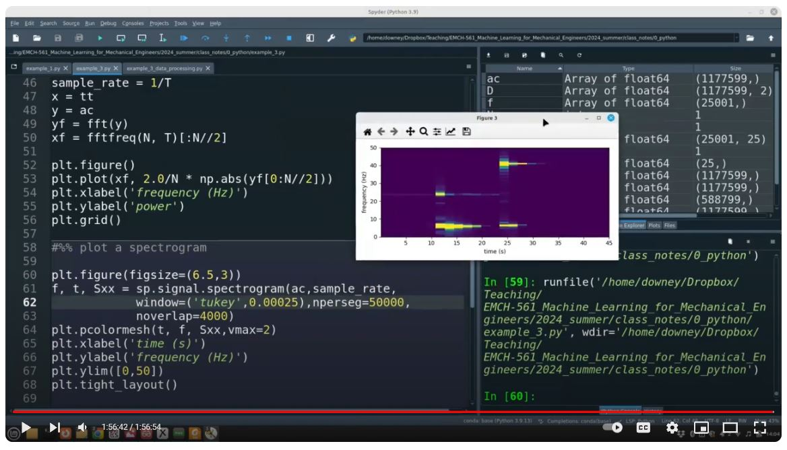

# Introduction to Python for Engineering Problem-Solving

A simple introduction to Python for engineering students; introduces the use of Anaconda for problem-solving in engineering. This provides a compare-and-contrast to Matlab. This course is centered around a vibrating beam example designed to quickly get students plotting and analyzing data using NumPy, SciPy, and Matplotlib. This final product is a spectrogram of a vibrating beam that experiences a mass drop. Typically takes 2 hours to do in a classroom setting. Everything the typical user will need is in the directory "course_material".

 Cantilever beam with a mass drop used to generate data for investigation and plotting.

 Spectrogram of the recorded signal showing the shift in the first three frequencies before and after the mass drops.  

## Accompanying Video Lecture

A YouTube video of a lecture that covers this material can be found [here](https://www.youtube.com/watch?v=KNRzxBLgfWE&ab_channel=ARTS-LabattheUniversityofSouthCarolina).

 Screenshot of the video lecture that accompanies this repository which can be found [here](https://www.youtube.com/watch?v=KNRzxBLgfWE&ab_channel=ARTS-LabattheUniversityofSouthCarolina).  

## Licensing and Citation

This work is licensed under a Creative Commons Attribution-ShareAlike 4.0 International License [cc-by-sa 4.0].

