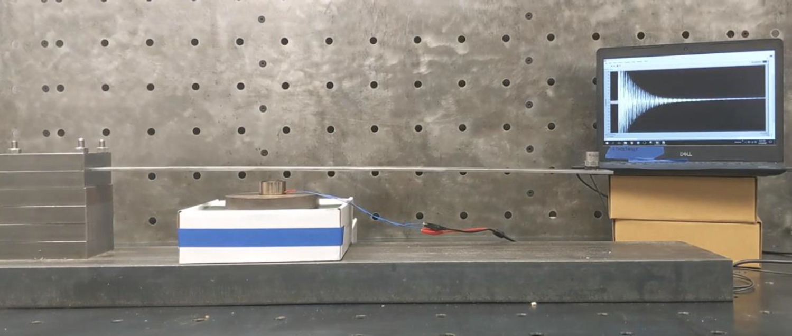

# Introduction-to-Python-for-engineers

A simple introduction to Python for engineering students that introduces the use of Anaconda for problem solving in engineering. This typically takes 2 hours to in a class-room setting and is  centered around a vibrating beam example that is designed to quickly get students plotting and analyzing data using NumPy, SciPy, and Matplotlib. This final product is a spectrogram of a vibrating beam that experiences a mass drop.

 text 

 

